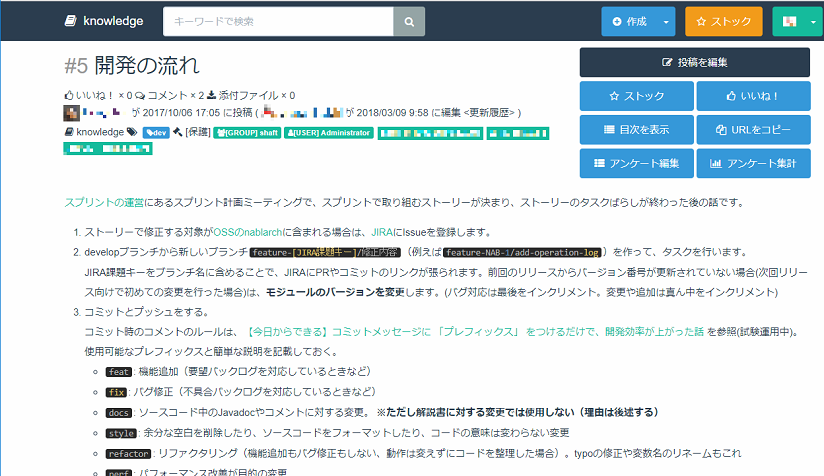
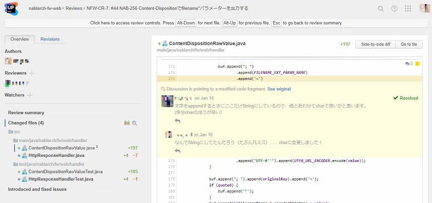
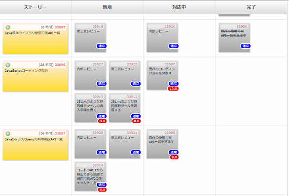
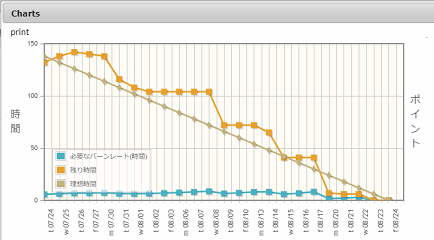

# マインドセットを実行に移すためのプラクティス

ここでは[マインドセット](./mindset.md)を具体的な行動に移すためのプラクティスを解説します。

## 「1. 存在感を出す」に対するプラクティス

### チャットで「独り言チャンネル」を運用する

「独り言チャンネル」とは、各メンバーに用意する自分専用のチャンネルです。
チャンネルはオープンにして誰もが見られるようにしておきます。

そこには「これからやろうとしていること」や「やってみて感じたこと」、「難しくて詰まっているところ」など、どんなことでも良いので不定期に書き込みます。

こうすることで他のメンバーへ対して存在感を出せますし、「難しくて詰まっているところ」を素直に呟いてみると解決策を知っているメンバーが助け舟を出してくれたりします。

我々も「独り言チャンネル」を運用する前は、他方のロケーションに居るメンバーが今何をやっているのかが把握し辛く、一緒に仕事をしている感覚が薄くなりがちでした。
「独り言チャンネル」を運用し始めたことでコミュニケーションが活発になり、各メンバーの存在感はもちろん、それぞれの個性も分かるようになりました。

上記の他にも「打ち合わせで1時間ほど離席」や「5分休憩する」といった発言をする事も、行動を見える化できるのでお勧めします。

世間では「分報チャンネル」という名前で実践されているものに近いですが、過剰に義務感を与えないために我々は「独り言チャンネル」という名前にしています。

- 参考：[Slackで簡単に「日報」ならぬ「分報」をチームで実現する3ステップ〜Problemが10分で解決するチャットを作ろう](http://c16e.com/1511101558/)（外部サイト）

チームを越えて部門や会社といった単位でチャットを使用している場合、すべてのアカウントがそれぞれ独り言チャンネルに投稿をすると通知が大量になってしまうので普段から目にする独り言チャンネルは絞りましょう。
例えばSlackだと次のような方法で工夫ができます。

- 参加していないチャンネルの通知は来ないので、チームメンバーの独り言チャンネルには参加して、チーム外の独り言チャンネルには参加しない
- 参加しているチャンネル毎に通知をミュートできるので、チーム外の独り言チャンネルは通知をミュートする

### TV会議ではマイクの位置に注意して話す

TV会議はオンサイトで話をしている場合とは異なり、マイクを意識して話す必要があります。
マイクから離れていたり、顔をマイクの方向に向けていないと声は拾われません。
マイクを通さないとTVの向こう側には声が届きませんので、声が拾われないと存在感が出ません。

また話しているのが誰か分かりやすいように、話をしている人は身振りをしたり喋り始める時に体をカメラに向けるなど、動きを付けてみましょう。

聞いている方もただ黙って聞くのではなく、「はい」「なるほど」「分かりました」という風に相槌を打ちましょう。
もしくは首を縦に振って同意を示す、という風にリアクションをしましょう。

#### マイクにノイズを拾わせないようにする

マイクの位置に注意して話すことで存在感を出すのは良い事ですが、同時にマイクを通して届いてしまうノイズにも注意しましょう。

- キーボードの打鍵
- ノートをめくる
- 飲み物を机に置く

これらをマイクのすぐそばで行うと、その音をマイクが拾ってしまい思った以上のノイズになってしまいます。

議事録を担当する場合は少しマイクから離れてみたり、飲み物を机に置く場合はゆっくりと静かに置くよう注意してみてください。

#### TV会議では同時に複数の話題をしない

会議ではふとしたタイミングで数人毎に分かれて雑談が始まる場合もあります。

オンサイトであればあまり気になりませんが、TV会議は音が平面的に届くのですべての話題が同じように耳に入ってきてしまい、苦になります。

TV会議では同時に複数の話題をしないように注意しましょう。

## 「2. コミュニケーションをデジタル化する」に対するプラクティス

### Webサービスやオンプレミスに導入可能なソフトウェアを活用する

コミュニケーションをデジタル化するためには、コミュニケーションに特化したツールを使用するのが良いでしょう。
そういったツールにはWeb上でサービスとして提供されているものや、オンプレミスに導入可能なソフトウェアがあります。

我々が実際に使用してみて有用だった物を紹介します。
次の表ではWeb上でサービスとして提供されているものを「Webサービス」、オンプレミスに導入可能なソフトウェアを「ソフトウェア」と分類しています。

|役割|名前|種類|
|---|---|---|
|チャット|[Slack](https://slack.com/)|Webサービス|
|チャット|[Rocket.Chat](https://github.com/RocketChat/Rocket.Chat)|ソフトウェア|
|情報共有|[Knowledge](https://github.com/support-project/knowledge)|ソフトウェア|
|コードレビュー|[Upsource](https://www.jetbrains.com/upsource/)|ソフトウェア|
|タスク管理|Redmineの[Backlogsプラグイン](https://github.com/backlogs/redmine_backlogs)|ソフトウェア|

#### チャット

チャットはWebサービスとソフトウェアの両方を紹介しています。
Slackをお勧めしますが、組織の都合でWebサービスの使用は難しい、といった場合はソフトウェアであるRocket.Chatを試してみてください。

チャットで工夫している使い方を1つ紹介します。
我々はタスクの見積もり方法にプランニングポーカーという手法を採用しています。
プランニングポーカーの詳細は[プランニングポーカー・オブジェクトゲームでアジャイルゲーム！～Agile 2011 Conference](https://enterprisezine.jp/iti/detail/3385)（外部サイト）を参照してください。

我々は複数ロケーションに跨った環境でプランニングポーカーをするためにSlackのリアクションを使用しています。
Slackにタスクの名前をポストして、掛け声に合わせてメンバーが一斉に`:one:` `:two:` `:three:` `:five:` `:eight:`といった数字のリアクションを付けます。
この数字のリアクションでプランニングポーカーを実施しています。

#### 情報共有

Knowledgeはマークダウンで書いて投稿できる情報共有ツールです。

我々は開発環境構築ガイドやリリース手順といった資料や、打ち合わせの議事録をKnowledgeへ投稿しています。
またチャット上で議論をするときも、概要や議論したいポイントをKnowledgeへ投稿しておいて、それを見ながら議論を進めることもあります。

 
Knowledgeに書いたドキュメントの例

#### コードレビュー

UpsourceはJetBrains社が開発しているコードレビューツールです。

同じJetBrains社が開発しているIntelliJ IDEAとの連携機能があるので、IntelliJ IDEAを使用しているとコードレビューがスムーズに行えます。

WebのUIがあるので、IntelliJ IDEAを使っていなくてもUpsourceは使えます。

大変便利に使えて、自信をもってお勧めできるツールです。

 
Upsourceでコードレビューをしている様子

#### タスク管理

我々は開発手法にスクラムを採用しています。

スクラムではタスクを細かい粒度まで落とし込みますが、そういった場合にRedmineのBacklogsプラグインで使用できるカンバンが便利です。

またタスクを細かく分割して、悩まずに消化できるレベルまで落とし込むことで、自主的にタスクを取って作業を進められます。

 
カンバンの例

 

 
バーンダウンチャートも見られる

## 「3. 情報共有のために記録する」に対するプラクティス

### 短期的な記録はチャットで行う

チャットは会話のようにリアルタイムなコミュニケーションをするためのツールですが、オンサイトの会話と異なりテキストデータがログとして残ります。

リアルタイムなコミュニケーションのため相槌も記録されますし、感情を表すため感嘆符だけの発言やアスキーアートもログには含まれるでしょう。

このように、その場の空気感を含んだやり取りは短期的な記録としては有効です。

### 長期的な記録は議事録を作成する

短期的な記録としてチャットが使えることを示しましたが、ずっと後から見返す場合、空気感はむしろノイズになることがあります。
また、チャットはすぐに流れていくので過去の記録を探し出すのは大変です。
実際に我々もチャットのログに頼ることで、かえって情報共有が難しくなった経験をして、議事録を残すようになりました。

長期的な記録はそれらノイズを取り除いて、要点を整理した形で議事録を残しましょう。
チャットは流れてしまうので、チャットとは別の場所に作ることを推奨します。

我々はKnowledgeに記録することが多いです。

## 「4. コミュニケーション手段を使い分ける」に対するプラクティス

### 普段の会話にはチャットを使う

ベースのコミュニケーション手段はチャットにするのが良いでしょう。
チャットは気軽に読み書きできますし、直近の会話がログとして残るので会話の流れが追いやすく、メンバー間の情報共有が行いやすいです。

また天気の話や趣味の話題など、他愛もない雑談をするのにも適しています。

### 1対1で会話しながら話題を整理するために電話を使う

チャットで議論はできますが漠然としたアイデアを話し合って整理するには、よりリアルタイムにインタラクティブなコミュニケーションができる電話の方が向いている場合があります。

ただし電話はチャットと異なり、ログが残りません。
電話が終わったら忘れないうちに話し合った内容と結論をチャットや議事録に記載しましょう。

### 多人数で話題を整理するためにTV会議を使う

電話は1対1のコミュニケーション手段です。
より多くのコミュニケーションでアイデアを整理する場合は、TV会議を使用しましょう。

TV会議は互いの表情が見えるので、オンサイトに近しい感覚でコミュニケーションが行えます。

電話の場合と同じくログが残らないので、TV会議が終わったら話し合った内容と結論をチャットや議事録に記載しましょう。

### チーム外に連絡するためにメールを使う

チーム外へ連絡する場合は普段使っているWebサービスやソフトウェアは使えない事が多いでしょう。
その場合はメールを使いましょう。

またチーム外への連絡手段として電話を使える場合でも記録を残すという観点から、メールでも電話で話した内容と同じものを送付するようにしましょう。

## 「5. なるべくロケーションで仕事を分けない」に対するプラクティス

### しっかりタスク分割ができる場合はロケーションで仕事を分けない

タスクを作業レベルに細かく分割できる場合、複数ロケーションで1つのテーマに取り組みましょう。

タスクが作業レベルに分割されていると、メンバーが自主的にタスクを取って仕事を進めやすいです。

### 細かいタスク分割が難しい場合はロケーションで仕事を分ける

細かい粒度でタスク分割が出来ない場合、ロケーション単位で大きなテーマを割り当てても良いでしょう。

各ロケーションで大きなテーマを荒い粒度のタスクに分割して作業を進めます。

## 「6. 慣れないうちは単独リモートを避ける」に対するプラクティス

### 単独リモートになる場合はリモート開発をしない

多くのメンバーがリモート開発を体験して、慣れていれば問題はありませんが、慣れないメンバーしかいない場合はリモート開発をしないということも選択肢の1つです。

まずはオンサイトでリモート開発に適したツールを使用してみるのも良いでしょう。

- チャットに慣れてみる
- 議事録をKnowledgeで残す習慣をつける
- Redmine Backlogsプラグインのカンバンを使用してタスク管理をしてみる

このようにツールに慣れておくと、スムーズにリモート開発へ移行できるでしょう。

### リモート開発をしていることを常に意識する

1対多に分かれる場合、「多」の方がリモート開発を常に意識するべきです。

- 口頭で連絡した後は、チャットや議事録に転記する
- TV会議で多人数の方だけで盛り上がらない
- タスクの割り振りや指示が偏らないようにする

すべてのロケーションで1つのチームであることを強く意識して、情報共有をしましょう。
情報共有が密にされていると、疎外感はありません。

